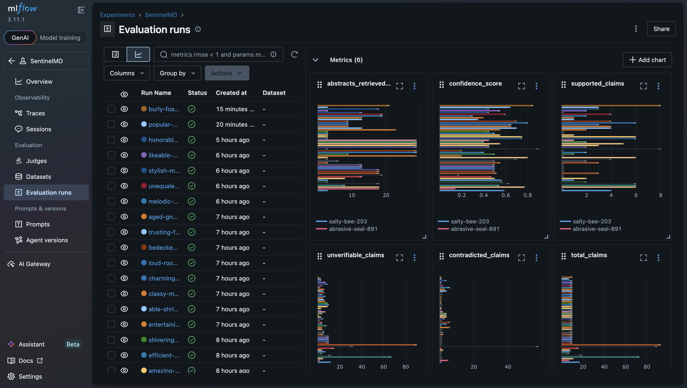

# SentinelMD - Clinical LLM Hallucination Detection System

A production safety system that detects hallucinations in LLM-generated clinical responses. SentinelMD retrieves relevant PubMed literature via RAG, generates a grounded clinical response, verifies every claim using NLI scoring, and enriches drug-related queries with FDA label data, returning an annotated response with per-claim labels, an overall reliability score, and real-time pipeline progress via SSE streaming.

---

## Demo

🔗 **[Live Demo](https://sentinelmd-nine.vercel.app/)**
🔗 **[Backend API](https://andrewvfranco-sentinelmd.hf.space)**

Submit a clinical question or attach a FHIR R4 resource. The system retrieves PubMed literature, generates a grounded response, and annotates each claim as **Supported**, **Contradicted**, or **Unverifiable** with citations and evidence.


---

## Motivation

LLMs are increasingly being deployed in safety critical settings, but they are prone to hallucinations. A model confidently stating an incorrect drug dosage or contraindication can directly harm patients.

SentinelMD functions as a **safety layer** that sits on top of any LLM, verifying its claims against authoritative medical literature and FDA drug labels in real time. Built on 8+ years of clinical experience working in ICU/ER, this system was designed with a real understanding of how bad clinical information propagates through care workflows and what the consequences look like at the bedside.

---

## Architecture

SentinelMD uses a **LangGraph agentic pipeline** that makes routing decisions at each step rather than executing a fixed sequence.

```
User Query / FHIR Resource
    │
    ▼
[Router] ──── FHIR? ────► fhir_input (HAPI R4 server fetch + parse)
    │                            │
    └────────────────────────────┘
    ▼
preprocess_query          PICO-structured PubMed search term extraction
    │
    ▼
pubmed_retrieval          NCBI E-utilities → BioBERT embeddings → Pinecone (namespaced)
    │                     Semantic search returns top-3 most relevant abstracts
    ▼
detect_medications        Scans query + abstracts for drug names
    │
    ├── drugs found? ──► fda_enrichment   OpenFDA drug label retrieval per medication
    │                          │
    └──────────────────────────┘
    ▼
llm_generation            Gemma 3 27B generates response grounded in abstracts + FDA labels
    │
    ▼
parse_claims              Extracts up to 10 key verifiable claims as structured JSON
    │
    ▼
nli_scoring               DeBERTa-v3-small NLI scores each claim against each abstract
    │                     Labels: Supported / Contradicted / Unverifiable
    ▼
confidence_scoring        Aggregates NLI scores into overall reliability score (0–100%)
    │
    ▼
assembly                  Returns annotated response + MLflow logging
```

---

## Key Features

**LangGraph Agentic Pipeline** - conditional routing at each step, not a fixed sequence. Medication detection triggers FDA enrichment only when needed. FHIR input routes to a dedicated parser before the main pipeline.

**PubMed RAG with Pinecone** - PICO-structured search queries hit NCBI E-utilities, abstracts are embedded with BioBERT and stored in namespaced Pinecone indexes to prevent cross-query contamination.

**OpenFDA Drug Label Integration** - automatically detects medications in both the query and retrieved abstracts, pulls authoritative FDA label sections (warnings, contraindications, adverse reactions, drug interactions, dosage, indications), and surfaces them in an interactive drug label carousel alongside NLI-verified claims.

**FHIR R4 Input** - accepts FHIR Condition, MedicationRequest, and DiagnosticReport resources via the HAPI public test server. Extracts clinical context and generates a structured query automatically.

**SSE Streaming** - real-time pipeline progress streamed to the frontend via Server-Sent Events. Users see each node completing rather than waiting on a loading indicator.

**MLflow Monitoring** - every query run logs confidence score, claim distribution, and abstracts retrieved to MLflow for production monitoring and trend analysis.



---

## Tech Stack

| Component | Technology |
|---|---|
| Agentic Orchestration | LangGraph + LangChain |
| Vector Database | Pinecone (serverless, namespaced) |
| Embeddings | BioBERT (pritamdeka/BioBERT-mnli-snli-scinli-scitail-mednli-stsb) |
| LLM | Gemma 3 27B via Google AI Studio |
| NLI Scoring | DeBERTa-v3-small (cross-encoder/nli-deberta-v3-small) |
| Literature Source | PubMed via NCBI E-utilities API |
| Drug Label Source | OpenFDA Drug Label API |
| FHIR Integration | HAPI FHIR Public R4 Server |
| Backend | FastAPI (async, SSE streaming) |
| Frontend | React + React Markdown (mobile responsive) |
| Containerization | Docker |
| CI/CD | GitHub Actions |
| Monitoring | MLflow |
| Config Management | Pydantic Settings |
| Backend Deployment | Hugging Face Spaces |
| Frontend Deployment | Vercel |

---

## Evaluation

RAG pipeline evaluated using RAGAS on 8 clinical test queries.

| Metric | Score |
|---|---|
| Faithfulness | 0.774 |
| Context Precision | 0.561 |

Faithfulness of 0.774 indicates that 77% of LLM claims are grounded in the retrieved literature. Context precision reflects the variability of PubMed results across diverse clinical domains.

---

## Project Structure

```
sentinelmd/
├── .github/workflows/      # GitHub Actions CI/CD
├── configs/                # App configuration
├── docker/                 # Dockerfile + docker-compose.yml
├── docs/                   # Screenshots and documentation assets
├── frontend/               # React frontend (deployed to Vercel)
│   └── src/
│       ├── components/     # Sidebar, ChatWindow, ClaimItem, DrugCarousel
│       └── App.js
├── logs/                   # MLflow tracking
├── notebooks/              # RAGAS evaluation notebook
├── scripts/                # Local development startup script
├── src/
│   ├── agent/              # LangGraph pipeline
│   │   ├── graph.py        # Agent graph definition
│   │   ├── nodes.py        # Node functions
│   │   └── state.py        # AgentState TypedDict
│   ├── api/                # FastAPI endpoints (query, fhir, health)
│   │   └── main.py
│   ├── core/               # Centralized config (pydantic-settings)
│   │   └── config.py
│   ├── fhir/               # FHIR R4 client and parser
│   │   ├── hapi_client.py
│   │   └── parser.py
│   ├── monitoring/         # MLflow logging
│   │   └── mlflow_logger.py
│   └── retrieval/          # PubMed, Pinecone, OpenFDA
│       ├── pubmed.py
│       ├── vector_store.py
│       └── fda.py
├── tests/
├── .env.example
├── Dockerfile
├── pyproject.toml
└── requirements.txt
```

---

## Setup

### Requirements

- Python 3.11
- Node.js 18+
- Pinecone account (free tier)
- Google AI Studio API key (free tier)
- NCBI API key (free)

### Installation

```bash
git clone https://github.com/AndrewVFranco/clinical-llm-hallucination-detector.git
cd clinical-llm-hallucination-detector
python3.11 -m venv .venv
source .venv/bin/activate
pip install -r requirements.txt
```

### Configuration

```bash
cp .env.example .env
```

Required environment variables:

```
NCBI_API_KEY=
GEMINI_API_KEY=
GEMINI_MODEL=gemma-3-27b-it
PINECONE_API_KEY=
PINECONE_INDEX_NAME=
HF_TOKEN=
MLFLOW_TRACKING_URI=http://127.0.0.1:5000
```

### Running Locally

```bash
# Start MLflow
mlflow server --host 127.0.0.1 --port 5000 --backend-store-uri ./logs/mlflow

# Start backend
uvicorn src.api.main:app --reload --port 8000

# Start frontend
cd frontend && npm install && npm start
```

### Docker

```bash
docker compose -f docker/docker-compose.yml up --build
```

---

## Key Design Decisions

**Why LangGraph over a fixed pipeline?**
LangGraph allows conditional routing at each step - FDA enrichment only triggers when medications are detected, FHIR parsing only runs when a resource ID is provided.

**Why Pinecone with namespaces?**
Each query gets its own isolated namespace in Pinecone, preventing cross-contamination from previous queries while still maintaining a persistent knowledge store that grows over time. This solved a real retrieval quality problem where stale abstracts from previous sessions were polluting semantic search results.

**Why BioBERT for embeddings?**
General-purpose sentence transformers produce weak embeddings for clinical text because they weren't trained on biomedical language. BioBERT was pretrained on PubMed abstracts and fine-tuned on MedNLI, making it significantly better at capturing semantic similarity in clinical contexts.

**Why NLI over cosine similarity for claim verification?**
Cosine similarity tells you whether two pieces of text are topically related. NLI tells you whether one piece of text entails, contradicts, or is neutral toward another. A claim saying "aspirin reduces mortality in STEMI" requires entailment detection, not topic matching.

**Why DeBERTa-v3-small over MiniLM?**
The lightweight MiniLM model struggled with paraphrase matching, claims semantically equivalent to the evidence but phrased differently were incorrectly marked Unverifiable. DeBERTa-v3-small provides meaningful accuracy improvement within the memory constraints of a free-tier deployment.

**Why FDA labels as a separate layer from PubMed?**
Research literature and regulatory labels serve different epistemic roles. FDA labels are authoritative ground truth for drug safety information. PubMed abstracts provide clinical research context. Keeping them separate, FDA for the drug carousel display, both for NLI verification gives the system two complementary evidence sources without conflating them.

---

## Background

Developed as a portfolio project demonstrating full-stack ML engineering in clinical AI safety. Informed by 8+ years of clinical experience in ICU/ER, with real-world awareness of how dangerous unverified clinical information is at the point of care and what the consequences look like when clinicians act on bad data.

---

## Roadmap

- **v1.1** — Energy-based out-of-distribution detection for NLI scoring, DeBERTa-v3-large upgrade
- **v1.2** — ClinicalTrials.gov integration for trial-level evidence
- **v1.3** — FHIR Bundle support for multi-resource input

---

## License

MIT License — see `LICENSE` for details.