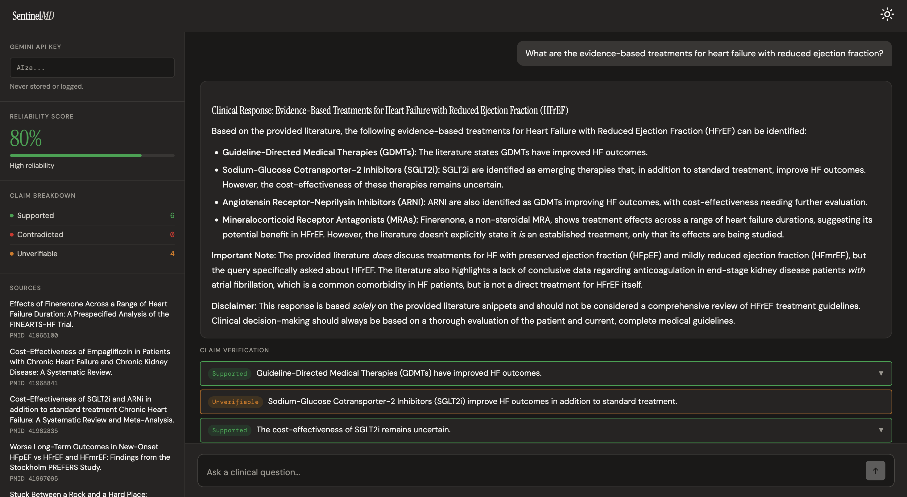

# SentinelMD — Clinical LLM Hallucination Detection System

A production safety system that detects hallucinations in LLM-generated clinical responses. SentinelMD retrieves relevant PubMed literature via RAG, generates a clinical response grounded in that literature, and verifies every claim using NLI scoring — returning an annotated response with per-claim labels and an overall reliability score.

---

## Demo

🔗 **[Live Demo — Hugging Face Spaces](https://huggingface.co/spaces/AndrewVFranco/SentinelMD)**

Submit a clinical question. The system retrieves PubMed literature, generates a grounded response, and annotates each claim as **Supported**, **Contradicted**, or **Unverifiable** with citations.



---

## Motivation

LLMs are increasingly being deployed in clinical settings, but they hallucinate — and in healthcare, hallucinations are dangerous. A model confidently stating an incorrect drug dosage or contraindication can directly harm patients.

SentinelMD addresses this by functioning as a **safety layer** that sits on top of any LLM, verifying its claims against authoritative medical literature in real time. Drawing on 8+ years of clinical experience in cardiac telemetry, this system was designed with a real understanding of how bad clinical information propagates through care workflows and what the consequences look like.

---

## Architecture

SentinelMD uses a **LangGraph agentic pipeline** that makes routing decisions at each step rather than executing a fixed sequence.

```
User Query
    │
    ▼
preprocess_query          Extract 3-6 word PubMed search terms from full query
    │
    ▼
pubmed_retrieval          Search NCBI E-utilities → embed with BioBERT → upsert to Pinecone
    │                     Semantic search returns top-5 most relevant abstracts
    ▼
llm_generation            Gemma 3 27B generates response grounded in retrieved abstracts
    │
    ▼
parse_claims              LLM extracts discrete verifiable claims from response as JSON
    │
    ▼
nli_scoring               CrossEncoder NLI model scores each claim against each abstract
    │                     Labels: Supported / Contradicted / Unverifiable
    ▼
confidence_scoring        Aggregates NLI scores into overall reliability score (0–100%)
    │
    ▼
assembly                  Returns annotated response with claims, evidence, and score
```

---

## Tech Stack

| Component | Technology |
|---|---|
| Agentic Orchestration | LangGraph + LangChain |
| Vector Database | Pinecone (serverless) |
| Embeddings | BioBERT (pritamdeka/BioBERT-mnli-snli-scinli-scitail-mednli-stsb) |
| LLM | Gemma 3 27B via Google AI Studio |
| NLI Scoring | CrossEncoder (cross-encoder/nli-MiniLM2-L6-H768) |
| Literature Source | PubMed via NCBI E-utilities API |
| Backend | FastAPI (async) |
| Frontend | React + React Markdown |
| Containerization | Docker + Docker Compose |
| CI/CD | GitHub Actions |
| Monitoring | MLflow |
| Config Management | Pydantic Settings |

---

## Evaluation

*RAG pipeline evaluation via RAGAS — coming in v1.1*

| Metric | Score |
|---|---|
| Faithfulness | TBD |
| Answer Relevancy | TBD |
| Context Precision | TBD |
| Context Recall | TBD |

---

## Project Structure

```
sentinelmd/
├── .github/workflows/      # GitHub Actions CI/CD
├── configs/                # App configuration (settings.yaml)
├── docker/                 # Dockerfile + docker-compose.yml
├── frontend/               # React frontend
│   └── src/
│       ├── components/     # Sidebar, ChatWindow, ClaimItem
│       └── App.js
├── logs/                   # MLflow tracking
├── notebooks/              # Evaluation notebooks
├── scripts/                # start.sh
├── src/
│   ├── agent/              # LangGraph pipeline
│   │   ├── graph.py        # Agent graph definition
│   │   ├── nodes.py        # Node functions
│   │   └── state.py        # AgentState TypedDict
│   ├── api/                # FastAPI endpoint
│   │   └── main.py
│   ├── core/               # Config and shared utilities
│   │   └── config.py
│   ├── monitoring/         # MLflow logging
│   └── retrieval/          # PubMed + Pinecone + vector store
│       ├── pubmed.py
│       └── vector_store.py
├── tests/
├── .env.example
├── pyproject.toml
└── requirements.txt
```

---

## Setup

### Requirements

- Python 3.11
- Node.js 18+
- Docker + Docker Compose
- Pinecone account (free tier)
- Google AI Studio API key (free tier)
- NCBI API key (free)

### Installation

```bash
git clone https://github.com/AndrewVFranco/clinical-llm-hallucination-detector.git
cd clinical-llm-hallucination-detector
python3.11 -m venv .venv
source .venv/bin/activate
pip install -r requirements.txt
```

### Configuration

Copy `.env.example` to `.env` and fill in your keys:

```bash
cp .env.example .env
```

Required environment variables:

```
NCBI_API_KEY=
GEMINI_API_KEY=
PINECONE_API_KEY=
PINECONE_INDEX_NAME=
HUGGING_FACE_HUB_TOKEN=
```

### Running Locally

**Backend:**
```bash
uvicorn src.api.main:app --reload --port 8000
```

**Frontend:**
```bash
cd frontend
npm install
npm start
```

### Docker

```bash
docker compose -f docker/docker-compose.yml up --build
```

---

## Key Design Decisions

**Why LangGraph over a fixed pipeline?**
LangGraph allows the system to make routing decisions at each step rather than executing a fixed sequence. This mirrors how production ML systems actually work rather than academic demos.

**Why Pinecone over ChromaDB?**
Pinecone is a production-grade managed vector database used in real health tech deployments. The persistent index accumulates medical literature over time, improving semantic retrieval quality across sessions.

**Why BioBERT for embeddings?**
General-purpose sentence transformers produce weak embeddings for clinical text because they weren't trained on biomedical language. BioBERT was pretrained on PubMed abstracts and fine-tuned on MedNLI, making it significantly better at capturing semantic similarity in clinical contexts.

**Why NLI over cosine similarity for claim verification?**
Cosine similarity tells you whether two pieces of text are topically related. NLI tells you whether one piece of text entails, contradicts, or is neutral toward another — which is the correct operation for hallucination detection.

---

## Background

Developed as a portfolio project demonstrating full-stack ML engineering in clinical AI safety. Informed by 8+ years of clinical experience in cardiac telemetry monitoring, with real-world awareness of how dangerous unverified clinical information is at the point of care — and what the consequences look like when it goes wrong.

---

## Roadmap

- **v1.1** — RAGAS evaluation, MLflow monitoring dashboard
- **v1.2** — OpenFDA drug label integration for medication claim verification
- **v1.3** — FHIR DiagnosticReport input layer

---

## License

MIT License — see `LICENSE` for details.